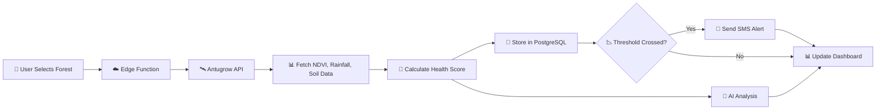

  # 🌳 JuaMsitu

<div align="center">

  

**AI-Powered Forest Intelligence • Real-Time Monitoring • Community Empowerment**

[🎯 Live Demo](https://juamsitu.vercel.app/)  [✨ Presentation Slides](https://www.canva.com/design/DAG5ckZ3lsM/URczQl92mwJ9EhjRR9hwAA/edit?utm_content=DAG5ckZ3lsM&utm_campaign=designshare&utm_medium=link2&utm_source=sharebutton) [📖 Full Documentation](https://docs.google.com/document/d/1jZdZs0MGkJL2McP89MTtgDTkOpu_w4ii8CXmKcWTcMw/edit?usp=sharing)

</div>

---

## 🌟 Description

**JuaMsitu** (Swahili for "Know Your Forest") is an AI-powered forest monitoring platform that converts satellite, soil, and weather data into a simple, readable **Forest Health Score (0-100)**.

It empowers communities, rangers, conservationists, and county governments with **real-time forest insights**, **AI explanations**, and **SMS alerts**, making forest protection easier and more accessible.

**Currently monitoring 445,419 hectares across 5 major Kenyan forests** 🌲

Built in honor of **Professor Wangari Maathai's vision** — giving every forest a voice.

---

## ✨ Key Features

### 🔢 **Forest Health Score**
*  Unified rating (0–100) generated from NDVI, rainfall, soil moisture, temperature, and tree density
*  Simplifies complex environmental metrics into a single intuitive score
*  A-F grading system anyone can understand
*  30-day trendline visualization for pattern tracking
*  Real-time updates with historical baseline comparison

### 🧠 **AI Insights Engine**
*  Powered by Google Gemini 2.5 Flash for expert-level analysis
*  Forest "health explanation" in simple, human language
*  Detects anomalies, declines, and environmental stress early
*  Identifies drought risk, deforestation, and canopy thinning
*  Suggests actionable follow-up steps and interventions

### 🌱 **Restoration Recommendations**
*  Data-driven recovery suggestions tailored to each forest
*  Tree species recommendations for reforestation
*  Water conservation and soil recovery strategies
*  Community-friendly action plans
*  Before/after restoration tracking and impact measurement

### 📲 **Alerts & Notifications**
*  Real-time SMS alerts for sudden forest health changes
*  Works on basic phones - no smartphone needed
*  Integrated with **Africa's Talking** for 95%+ delivery rate
*  Custom threshold settings for personalized monitoring
*  Keeps rangers aware even when offline

### 📄 **Report Export**
*  One-click downloadable PDF forest health reports
*  Includes health score, AI analysis, and recommendations
*  Historical trends and comparative data
*  Ready for county offices, environmental clubs, and NGOs
*  Perfect for grant applications and stakeholder meetings

### 📊 **Clean, Simple Dashboard**
*  Minimal, modern UI with intuitive navigation
*  Interactive forest map with instant selection
*  Fully responsive - works on mobile, tablet, and desktop
*  Fast loading even on slow connections
*  Multi-language support (English & Swahili)

---

## 🛠️ Tech Stack

<div align="center">

### Frontend
    

### Backend & Database
  

### External APIs
  

### Tools
  

</div>

---

## 🚀 Getting Started

### 📋 Prerequisites

Before you begin, ensure you have:

* ✅ Node.js (v18 or higher)
* ✅ Git
* ✅ pnpm or npm
* ✅ Supabase account (free tier works)
* ✅ Antugrow API key 

### 📥 Clone the Project

```bash
git clone https://github.com/yourusername/juamsitu.git
cd juamsitu
```

### 📦 Install Dependencies

```bash
# Install all dependencies
pnpm install

# Or with npm
npm install
```

### ⚙️ Environment Variables

Create a `.env` file in the project root:

```env
# 🗄️ Supabase Configuration
VITE_SUPABASE_URL=https://your-project.supabase.co
VITE_SUPABASE_ANON_KEY=your_supabase_anon_key

# 🛰️ Antugrow API (Satellite & Environmental Data)
ANTUGROW_API_KEY=your_antugrow_api_key
ANTUGROW_TOKEN=your_antugrow_token

# 📱 Africa's Talking (SMS Alerts)
AFRICAS_TALKING_API_KEY=your_api_key
AFRICAS_TALKING_USERNAME=your_username


### 🗄️ Set Up Database

```bash
# Link to your Supabase project
npx supabase link --project-ref your-project-ref

# Run database migrations
npx supabase db push

# Seed initial forest data (optional)
npx supabase db seed
```

### ⚡ Deploy Edge Functions

```bash
# Deploy all edge functions
npx supabase functions deploy

# Or deploy individually
npx supabase functions deploy fetch-forest-data
npx supabase functions deploy analyze-forest-health
npx supabase functions deploy send-sms
```

### 🎬 Run the Application

```bash
# Start development server
pnpm run dev

# Or with npm
npm run dev
```

🎉 **Your app is now running at** `http://localhost:5173`

💡 **Pro Tip:** Update your production API keys in the Supabase dashboard under Settings → Edge Functions!

---

## 🌲 Monitored Forests

<div align="center">

| 🌳 Forest Name | 📍 Location | 📏 Area (hectares) | 🗺️ Coordinates | ✅ Status |
|----------------|-------------|-------------------|----------------|----------|
| 🌳 **Karura Forest** | Nairobi | 1,041 | -1.2488°, 36.8328° | 🟢 Active |
| 🏔️ **Aberdare Forest** | Central Kenya | 76,619 | -0.3949°, 36.6993° | 🟢 Active |
| 🌲 **Mau Forest Complex** | Rift Valley | 273,300 | -0.3833°, 35.5833° | 🟢 Active |
| 🌿 **Kakamega Forest** | Western Kenya | 23,700 | 0.2736°, 34.8561° | 🟢 Active |
| ⛰️ **Mount Kenya Forest** | Central Kenya | 71,759 | -0.1521°, 37.3084° | 🟢 Active |

**📊 Total Coverage:** 445,419 hectares • **⚡ Live Monitoring** • **🔄 Daily Updates**

</div>

---

## 🔄 How It Works



**🔍 The Process:**

1. **🌍 Data Collection** - Fetch satellite imagery, weather, and soil data from Antugrow API
2. **🧮 Score Calculation** - Weighted algorithm combines metrics (NDVI 30%, Density 25%, Rain 20%, Soil 15%, Temp 10%)
3. **💾 Storage** - Historical data saved in PostgreSQL with timestamp
4. **🤖 AI Analysis** - Google Gemini generates natural language insights and recommendations
5. **🚨 Alert Trigger** - SMS sent via Africa's Talking if health score drops below threshold
6. **📊 Visualization** - Real-time dashboard updates with charts and trends

---

## 👥 The Team

<div align="center">

**🌟 Core Contributors**

| 👤 Name | 💼 Role | 🔗 GitHub | 💬 LinkedIn |
|---------|---------|-----------|-------------|
| 💻 **Amina** | Frontend & UX Design | [@aminanur](https://github.com/amina-nur) | [Connect →](https://linkedin.com/in/AminaNur) |
| ⚙️ **Aisha Barasa** | Backend & AI Integration | [@aishabarasa](https://github.com/Aisha-Barasa) | [Connect →](https://linkedin.com/in/AishaBarasa) |

### 🙏 Special Thanks

**🌳 Professor Wangari Maathai** - For inspiring environmental conservation  
**🌱 Green Belt Movement** - For decades of grassroots forest protection  
**🏛️ Kenya Forest Service** - For protecting Kenya's forest heritage  
**🛰️ Antugrow Team** - For providing crucial satellite data access  
**❤️ Open Source Community** - For the amazing tools and libraries

</div>

---

## 🏆 Project Milestones

### ✅ Phase 1: Core Platform

**Status:** 🎉 Completed (November 2024)

| Feature | Status | Description |
|---------|--------|-------------|
| 🔢 **Health Scoring Engine** | ✅ Complete | Weighted algorithm with 5 metrics, A-F grading |
| 📊 **Interactive Dashboard** | ✅ Complete | Real-time metrics, charts, forest map |
| 🤖 **AI Analysis** | ✅ Complete | Gemini 2.5 Flash integration, natural language insights |
| 📱 **SMS Alerts** | ✅ Complete | Africa's Talking integration, 95%+ delivery |
| 🔐 **Authentication** | ✅ Complete | JWT auth, role-based access (User/Ranger) |
| 📄 **Reports & Export** | ✅ Complete | PDF generation, CSV export |

### 🚧 Phase 2: Enhanced Intelligence

**Status:** 🔨 In Progress (Q2 2025)

| Feature | Status | Target |
|---------|--------|--------|
| 📱 **Mobile App** | 🔄 Planning | React Native iOS/Android |
| 🗺️ **Advanced GIS** | 🔄 Planning | Mapbox integration, custom layers |
| 🤖 **Predictive ML** | 🔄 Research | Risk forecasting models |
| 🌐 **Multi-Language** | 🔄 Planning | Kikuyu, Luo, Luhya support |
| 📡 **Live Data Pipeline** | 🔄 Planning | Real-time Antugrow updates |
| 📴 **Offline Mode** | 🔄 Planning | Field data collection |

### 🔮 Phase 3: Community & Scale

**Status:** 📋 Planned (Q3 2025)

| Feature | Status | Target |
|---------|--------|--------|
| 💬 **Community Forums** | 📋 Planned | Discussion boards per forest |
| 🙋 **Volunteer System** | 📋 Planned | Event management, tracking |
| 💰 **Carbon Credits** | 📋 Planned | Sequestration tracking |
| 🏛️ **Government Integration** | 📋 Planned | KFS & NEMA data exchange |
| 🌍 **Regional Expansion** | 📋 Planned | Uganda, Tanzania forests |
| 📊 **Impact Dashboard** | 📋 Planned | Conservation ROI metrics |

---

## 💚 Inspired By Wangari Maathai

<div align="center">


> *"Until you dig a hole, you plant a tree, you water it and make it survive, you haven't done a thing. You are just talking."*  
> — **Professor Wangari Maathai**

</div>

**🏆 Nobel Peace Prize Laureate** • **🌱 Founder of Green Belt Movement** • **🌳 51 Million Trees Planted**

### 💚 Her Vision, Our Mission

| 🌱 Maathai's Principle | 🌳 JuaMsitu's Implementation |
|------------------------|------------------------------|
| **👥 Community Empowerment** | SMS alerts work on basic phones - no smartphone needed |
| **📚 Environmental Education** | Complex data made simple for everyone to understand |
| **🌍 Grassroots Action** | Technology that mobilizes communities, not just experts |
| **📊 Measurable Impact** | Every forest tracked daily with quantifiable metrics |
| **👩 Women's Leadership** | Inclusive platform accessible to all community members |

JuaMsitu honors Professor Maathai's belief that **environmental conservation and community empowerment are inseparable**. We're not just monitoring forests — we're giving them a voice and communities the power to respond.

---

## 🌟 Support the Project

<div align="center">

**Love JuaMsitu? Here's how you can help! 💚**

</div>

| 💚 Action | 🎯 Impact |
|-----------|-----------|
| ⭐ **Star this repo** | Help others discover JuaMsitu |
| 🔄 **Share on social media** | Spread awareness in environmental networks |
| 🌱 **Contribute code** | Help build new features |
| 📢 **Provide feedback** | Tell us what works and what doesn't |
| 🌳 **Plant a tree** | Honor Wangari Maathai's legacy |
| 💰 **Sponsor development** | Enable full-time conservation tech work |
| 📝 **Write about us** | Blog posts, articles, case studies |

---

